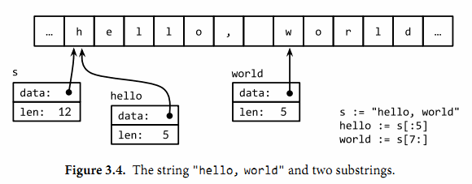

# 第3章 基础数据类型
Go语言将数据类型分为四类：
1. 基础类型: 包括数字、字符串和布尔型
2. 复合类型: 包括数组和结构体
3. 引用类型: 包括指针、切片、字典、函数和通道
4. 接口类型: 即接口

## 3.1 整型
1. Go语言同时提供了有符号和无符号类型的整数运算
   ```text
   有符号整数类型：int8、 int16、 int32、 int64、 int(32/64位)
   无符号整数类型：uint8、uint16、uint32、uint64、uint(32/64位)
   ```
2. Unicode字符rune类型是int32的等价类型，通常用于表示一个Unicode码点；byte是uint8类型的等价类型，一般用于强调数值是一个原始的数据而不是一个小的整数
3. `uintptr`是一种无符号的整数类型，没有指定具体的bit大小但是足以容纳指针，只有在底层编程时才需要
4. Go语言中的二元运算符如下：
   ```text
   *          /           %           <<（左移）          >>（右移）     &（位与AND）       &^（位清空AND NOT）
   +          -           |（位或OR）  ^（位异或XOR/位取反）
   ==（等于）  !=（不等于）  <（小于）    <=（小于等于）       >（大于）      >=（大于等于）
   &&
   ||
   ```
5. 在Go语言中，%取模运算符的符号和被取模数的符号总是一致的，因此`-5%3`和`-5%-3`结果都是-2
6. 字符面值通过一对单引号直接包含对应字符
   ```text
   ascii := 'a'
   unicode := '国'
   newline := '\n'
   fmt.Printf("%d %[1]c %[1]q\n", ascii)   // "97 a 'a'"
   fmt.Printf("%d %[1]c %[1]q\n", unicode) // "22269 国 '国'"
   fmt.Printf("%d %[1]q\n", newline)       // "10 '\n'"
   ```

## 3.2 浮点数
1. Go语言提供了2种精度的浮点数：float32和float64
2. 一个float32类型的浮点数可以提供大约6个十进制数的精度，而float64则可以提供约15个十进制数的精度
   ```text
   var z float64
   fmt.Println(z, -z, 1/z, -1/z, z/z) // "0 -0 +Inf -Inf NaN"
   ```

## 3.3 复数
1. Go语言提供了两种精度的复数类型：complex64和complex128，分别对应float32和float64两种浮点数精度
   ```text
   var x complex128 = complex(1, 2) // 1+2i
   var y complex128 = complex(3, 4) // 3+4i
   fmt.Println(x*y)                 // "(-5+10i)"
   fmt.Println(real(x*y))           // "-5"
   fmt.Println(imag(x*y))           // "10"
   fmt.Println(1i * 1i)             // "(-1+0i)", i^2 = -1
   x := 1 + 2i
   y := 3 + 4i
   fmt.Println(cmplx.Sqrt(-1))      // "(0+1i)"
   ```
2. 复数也可以用==和!=进行相等比较

## 3.4 布尔型
1. 一个布尔类型的值只有两种：true和false
2. 布尔值可以和`&&（逻辑与）`、`||（逻辑或）`和`!（逻辑非）`操作符结合，并且有短路行为
3. 布尔值并不会隐式地转换为数字值0或1，反之亦然
   ```text
   // btoi returns 1 if b is true and 0 if false.
   func btoi(b bool) int {
       if b {
           return 1
       }
       return 0
   }
   
   // itob reports whether i is non-zero.
   func itob(i int) bool {
       return i != 0
   }
   ```

## 3.5 字符串
1. 一个字符串是一个不可改变的字节序列
2. 文本字符串通常被解释为采用UTF8编码的Unicode码点（rune）序列
3. 内置的len函数可以返回一个字符串中的字节数目（不是rune字符数目）
   ```go
   s := "hello, world"
   fmt.Println(len(s))     // "12"
   fmt.Println(s[0], s[7]) // "104 119" ('h' and 'w')
   fmt.Println(s[0:5])     // "hello"
   fmt.Println(s[:5])      // "hello"
   fmt.Println(s[7:])      // "world"
   fmt.Println(s[:])       // "hello, world"
   fmt.Println("goodbye" + s[5:]) // "goodbye, world"
   ```
   
4. 第i个字节并不一定是字符串的第i个字符，因为对于非ASCII字符的UTF8编码会要两个或多个字节
5. 字符串的值是不可变的：一个字符串包含的字节序列永远不会被改变
   ```go
   s := "left foot"
   t := s
   s += ", right foot"
   fmt.Println(s)      // "left foot, right foot"
   fmt.Println(t)      // "left foot"
   s[0] = 'L'          // compile error: cannot assign to s[0]
   ```
6. 字符串值也可以用**字符串面值** 方式编写，只要将一系列字节序列包含在双引号内即可
7. Unicode码点对应Go语言中的rune整数类型（注：rune是int32的等价类型）
8. UTF8是一个将Unicode码点编码为字节序列的变长编码，而变长的编码无法直接通过索引来访问第n个字符
   ```text
   0xxxxxxx                             runes 0-127    (ASCII)
   110xxxxx 10xxxxxx                    128-2047       (values <128 unused)
   1110xxxx 10xxxxxx 10xxxxxx           2048-65535     (values <2048 unused)
   11110xxx 10xxxxxx 10xxxxxx 10xxxxxx  65536-0x10ffff (other values unused)
   ```
9. Unicode转义字符可以让我们通过Unicode码点输入特殊的字符
   ```text
   "世界"
   "\xe4\xb8\x96\xe7\x95\x8c"
   "\u4e16\u754c"
   "\U00004e16\U0000754c"
   
   '世' '\u4e16' '\U00004e16'
   ```
10. UTF8编码后文本的处理和原始的字节处理逻辑是一样的
   ```go
   import "unicode/utf8"
   
   s := "Hello, 世界"
   fmt.Println(len(s))                    // "13"
   fmt.Println(utf8.RuneCountInString(s)) // "9"
   fmt.Println(s[7:10])                   // 世，不推荐这样访问，很危险！
   
   for i := 0; i < len(s); {
       r, size := utf8.DecodeRuneInString(s[i:])
       fmt.Printf("%d\t%c\t%d\n", i, r, r)
       i += size
   }
   for i, r := range "Hello, 世界" { // 推荐这种方式
       fmt.Printf("%d\t%q\t%d\n", i, r, r)
   }
   ```
   
11. 将[]rune类型转换应用到UTF8编码的字符串，将返回字符串编码的Unicode码点序列
   ```go
   // "program" in Japanese katakana
   s := "プログラム"
   fmt.Printf("% x\n", s) // "e3 83 97 e3 83 ad e3 82 b0 e3 83 a9 e3 83 a0"
   r := []rune(s)
   fmt.Printf("%x\n", r)  // "[30d7 30ed 30b0 30e9 30e0]"
   fmt.Println(string(r)) // "プログラム"
   fmt.Println(string(65))     // "A", not "65"
   fmt.Println(string(0x4eac)) // "京"
   fmt.Println(string(1234567)) // "?"，如果对应码点的字符是无效的，则用\uFFFD无效字符表示
   ```
12. 标准库中有四个包对字符串处理尤为重要：bytes、strings、strconv和unicode包
13. 字符串和字节slice之间可以相互转换
   ```go
   s := "abc"
   b := []byte(s)
   s2 := string(b)
   ```
14. 整数可以与字符串之间互相转换
   ```go
   x := 123
   y := fmt.Sprintf("%d", x)
   fmt.Println(y, strconv.Itoa(x)) // "123 123"
   fmt.Println(strconv.FormatInt(int64(x), 2)) // "1111011"
   s := fmt.Sprintf("x=%b", x) // "x=1111011"
   x, err := strconv.Atoi("123")             // x is an int
   y, err := strconv.ParseInt("123", 10, 64) // base 10, up to 64 bits
   ```

## 3.6 常量
1. 常量表达式的值在编译期计算，而不是在运行期
   ```go
   const pi = 3.14159 // approximately; math.Pi is a better approximation
   const (
       e  = 2.71828182845904523536028747135266249775724709369995957496696763
       pi = 3.14159265358979323846264338327950288419716939937510582097494459
   )
   
   const noDelay time.Duration = 0
   const timeout = 5 * time.Minute
   fmt.Printf("%T %[1]v\n", noDelay)     // "time.Duration 0"
   fmt.Printf("%T %[1]v\n", timeout)     // "time.Duration 5m0s"
   fmt.Printf("%T %[1]v\n", time.Minute) // "time.Duration 1m0s"
   
   const (
       a = 1
       b
       c = 2
       d
   )
   fmt.Println(a, b, c, d) // "1 1 2 2"
   ```
2. 常量声明可以使用iota常量生成器初始化
   ```go
   type Weekday int
   const (
       Sunday Weekday = iota // 0
       Monday                // 1
       Tuesday               // 2
       Wednesday             // 3
       Thursday              // 4
       Friday                // 5
       Saturday              // 6
   )
   
   type Flags uint
   const (
       FlagUp Flags = 1 << iota // 1
       FlagBroadcast            // 2
       FlagLoopback             // 4
       FlagPointToPoint         // 8
       FlagMulticast            // 16
   )
   
   const (
       _ = 1 << (10 * iota)
       KiB // 1024
       MiB // 1048576
       GiB // 1073741824
       TiB // 1099511627776             (exceeds 1 << 32)
       PiB // 1125899906842624
       EiB // 1152921504606846976
       ZiB // 1180591620717411303424    (exceeds 1 << 64)
       YiB // 1208925819614629174706176
   )
   ```
3. Go语言有六种未明确类型的常量类型，分别是无类型的布尔型、无类型的整数、无类型的字符、无类型的浮点数、无类型的复数、无类型的字符串。
4. 无类型的常量不仅可以提供更高的运算精度，而且可以直接用于更多的表达式而不需要显式的类型转换
5. 只有常量可以是无类型的